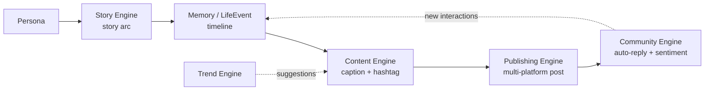

# PersonaOS — Codebase Summary

> This document summarizes the entire backend codebase of **PersonaOS** — an "AI Influencer Operating System".
> Up to date as of commit `3a2d681` (branch `main`).

---

## 1. Overview

**PersonaOS** is a system for creating and operating **AI Influencers** ("digital humans") with their own identity, personality, memory, life, content, and monetization capability.

- **Backend**: FastAPI (async Python 3.11+)
- **AI/LLM**: OpenAI (GPT-4o + GPT-4o-mini), behind an abstraction layer that allows swapping providers
- **Image generation**: OpenAI GPT Image (gpt-image-2 → gpt-image-1), with a free DiceBear SVG fallback
- **Database**: SQLAlchemy async — SQLite (dev) / PostgreSQL (prod)
- **Vector DB**: ChromaDB (for semantic memory — declared, not yet deeply integrated)
- **Validation**: Pydantic v2
- **UI**: Static dashboard at `backend/static/index.html`, mounted at `/app`

Design philosophy: **each phase = one independent Engine**, registered into the system via a router. Easy to add/remove modules.

---

## 2. Layered Architecture

```
HTTP request
   │
   ▼
api/v1/*.py        ← REST routes (FastAPI routers), validate I/O via schemas
   │
   ▼
services/*.py      ← Business logic, orchestrate Engine + Database (DB session via DI)
   │
   ├──► engine/*.py    ← AI "heart": calls the LLM, content-generation logic (stateless)
   │
   └──► models/*.py    ← ORM Models (SQLAlchemy), mapped to DB tables
            │
            ▼
        core/database.py  ← async engine + session factory
        core/llm.py       ← OpenAI abstraction layer
```

**Principle**: Services are stateless, receiving an `AsyncSession` via dependency injection. Engines handle only pure AI/logic and never touch the DB.

### Architecture diagram (Mermaid)

```mermaid
flowchart TD
    Client([Client / Dashboard UI]) -->|HTTP| API

    subgraph API["api/v1 — REST Routers"]
        P[persona] & S[story] & M[memory] & C[content]
        CH[chat] & PUB[publishing] & COM[community] & T[trend] & MED[media]
    end

    API -->|validate| SCH[schemas — Pydantic v2]
    API --> SVC

    subgraph SVC["services — Business Logic"]
        PS[persona_service] & SS[story_service] & MS[memory_service]
        CS[content_service] & CHS[chat_service] & PBS[publishing_service]
        CMS[community_service] & TS[trend_service] & MDS[media_service]
    end

    SVC --> ENG
    SVC --> MODELS

    subgraph ENG["engine — AI Core (stateless)"]
        PE[PersonaEngine] & STE[StoryEngine] & ME[MemoryEngine]
        CE[ContentEngine] & CVE[ConversationEngine]
        PUE[PublishingEngine] & CME[CommunityEngine] & TE[TrendEngine]
    end

    ENG --> LLM[core/llm — OpenAI abstraction]
    LLM --> OAI([OpenAI API<br/>GPT-4o / 4o-mini / GPT Image])
    PUE --> SOCIAL([Social APIs<br/>TikTok/IG/FB/Threads/X])
    TE --> TRENDS([Trend sources<br/>TikTok/IG/Reddit/X])

    MODELS[models — SQLAlchemy ORM] --> DB[core/database<br/>async engine]
    DB --> STORE([(SQLite / PostgreSQL)])
```

### Content lifecycle



---

## 3. Directory Tree

```
backend/app/
├── main.py              # FastAPI entry point: lifespan, CORS, mount static & media, /health
├── config.py            # Settings (pydantic-settings) — loaded from .env
├── core/
│   ├── database.py      # Async SQLAlchemy engine, get_db() DI, init_db()
│   ├── dependencies.py  # Re-exports get_db_session
│   └── llm.py           # LLM abstraction: LLM.chat / chat_json, generate_text / generate_json
├── models/              # ORM Models
│   ├── persona.py       # Persona (central entity)
│   ├── memory.py        # Memory + LifeEvent
│   ├── story.py         # Story (story arc — the "heart")
│   ├── content.py       # ContentPost + ContentSchedule
│   ├── social.py        # SocialAccount + SocialPost
│   ├── social_inbox.py  # SocialInboxMessage (unified multi-platform inbox)
│   ├── community.py     # Comment + InboxMessage + AutoReply
│   └── monetization.py  # AffiliateProduct + ClickEvent + ConversionEvent
├── schemas/             # Pydantic v2 schemas (request/response validation)
├── engine/              # AI Engines (stateless)
│   ├── persona_engine.py       # Generate personas
│   ├── story_engine.py         # Generate story arcs + convert to life events
│   ├── memory_engine.py        # Summarize conversations, generate life events, compute importance
│   ├── conversation_engine.py  # In-character chat
│   ├── content_engine.py       # Generate captions/hashtags
│   ├── publishing_engine.py    # Multi-platform publishing (Adapter pattern)
│   ├── community_engine.py     # Sentiment analysis, auto-reply
│   └── trend_engine.py         # Trend detection + content recommendations
├── services/            # Business logic (one service per engine)
├── utils/
│   └── prompt_templates.py     # Shared prompt templates
└── api/v1/
    ├── router.py        # Aggregates sub-routers, prefix /api/v1
    └── persona.py, story.py, memory.py, content.py, chat.py,
        publishing.py, community.py, trend.py, media.py
```

---

## 4. Engines (AI Core)

| Engine | Phase | Role | Model |
|--------|-------|------|-------|
| **PersonaEngine** | 1 | Generate a complete persona from a concept; supports "overrides" for user-specified hard fields (name, age, occupation...) | GPT-4o |
| **StoryEngine** | "Heart" | Create a story arc (event sequence + emotional arc + content ideas) tied to life goals; convert milestones into LifeEvents | GPT-4o |
| **MemoryEngine** | 2 | Summarize conversations → memories (with importance score); generate life-event timelines; heuristic importance | GPT-4o-mini |
| **ConversationEngine** | cross | In-character chat, injecting personality + memories + life events into the system prompt | GPT-4o |
| **ContentEngine** | 3 | Generate captions/story/reel/tweet + hashtags in the persona's voice; batch generation | GPT-4o-mini |
| **PublishingEngine** | 4 | Publish to TikTok/Instagram/Facebook/Threads/X via **Adapter pattern**; parallel publish, fetch stats | — (HTTP API) |
| **CommunityEngine** | 5 | Comment sentiment analysis (keyword + context), in-character replies, prioritize comments, handle inbox | GPT-4o-mini |
| **TrendEngine** | 6 | Fetch trends from TikTok/Instagram/Reddit/X (with curated fallback), score relevance, recommend content | GPT-4o-mini |

**Architectural highlights:**
- `publishing_engine.py` uses the **Adapter pattern**: `BasePlatformAdapter` (abstract) → `TikTokAdapter`, `InstagramAdapter`, `FacebookAdapter`, `ThreadsAdapter`, `XAdapter`. Adding a new platform = a new adapter + registration in `ADAPTER_MAP`.
- `trend_engine.py` has **graceful degradation**: if a trend API fails, it falls back to a curated trend list.
- The LLM is split into two tiers: a **primary model** (GPT-4o) for high-quality tasks (persona, story, chat) and a **lite model** (GPT-4o-mini) for high-volume tasks (captions, replies, trends).

---

## 5. Data Model

**Persona** is the central entity; everything else references `persona_id` (cascade delete).

- **Persona** — identity (name, age, occupation), appearance (`appearance` JSON), `fashion_style`, `unique_appeal`, `voice_style`, `personality_type`, `personality` (JSON: traits/tone/quirks/fears/pet_phrases...), `interests`, `life_goals` (structured JSON), `relationships` (JSON), `backstory`, `avatar_url` + `avatar_gen_prompt`, metrics (follower_count, total_earnings).
- **Memory** — three categories: `long_term` / `episodic` / `social`; has `importance` (0–1) and `embedding_id` (vector DB reference).
- **LifeEvent** — an event on the life timeline (with `mood_before`/`mood_after`, `event_date` can be in the future).
- **Story** — story arc: `emotional_arc`, `milestones` (JSON), progress (`current_milestone`), counters for generated events/posts.
- **ContentPost** — a post (caption, hashtags, media_urls, status draft→published, engagement metrics) + **ContentSchedule** (posting schedule).
- **SocialAccount** / **SocialPost** — connected accounts + published posts per platform.
- **SocialInboxMessage** — unified multi-platform inbox, dedupes replies via `platform_message_id` (unique), lifecycle `new → pending → replied/ignored`.
- **Comment** / **InboxMessage** / **AutoReply** — community interactions + auto-reply config.
- **AffiliateProduct** / **ClickEvent** / **ConversionEvent** — monetization (Phase 7–8, models exist but no API/engine yet).

---

## 6. API Endpoints (prefix `/api/v1`)

| Group | Key endpoints |
|-------|---------------|
| **Persona** | `POST /personas/generate` (AI generate), CRUD `/personas`, `POST /personas/{id}/regenerate-field`, `POST /personas/{id}/regenerate-avatar` |
| **Story** | `POST /stories/generate`, `GET /stories/active/{persona_id}`, `GET /stories/{persona_id}`, `POST /stories/{story_id}/complete` |
| **Memory** | `POST/GET /memories`, `POST/GET /life-events`, `POST /life-events/generate` |
| **Content** | `POST /content/generate`, `POST /content/generate/batch`, `GET /content/posts/{persona_id}`, `PATCH /content/posts/{post_id}/status`, `POST/GET /content/schedule` |
| **Chat** | `POST /chat` (in-character chat with a persona) |
| **Publishing** | `POST/GET/DELETE /accounts`, `POST /publish`, `POST /check-connection`, `POST /posts/{id}/stats` |
| **Community** | `POST /analyze-comment`, `POST /auto-reply`, `POST /inbox-reply`, `POST/GET /rules`, `GET /comments/{persona_id}` |
| **Trend** | `POST/GET /fetch`, `POST /recommend`, `GET /recommend/{persona_id}`, `GET /recommend-all` |
| **Media** | `POST /media/upload`, `GET /media/{subfolder}/{filename}`, `POST /media/generate-avatar` |
| **Health** | `GET /` (redirect to /app), `GET /health` |

Swagger UI: `http://localhost:8000/docs`.

---

## 7. Key Business Flows

**Persona creation (Phase 1):**
```
POST /personas/generate
  → PersonaService.generate()
     → (if a reference image is provided) MediaService.analyze_reference_image()  # GPT-4o Vision → EN prompt + VI description
     → PersonaEngine.generate()                                                   # GPT-4o generates persona JSON
     → persist to DB
     → MediaService.generate_avatar()                                            # gpt-image-2 → gpt-image-1 → DiceBear
```

**Content lifecycle (per README):**
```
Persona → Story Engine → Memory/LifeEvent → Content Engine → Publishing → Community
```

**Avatar generation (notable — `media_service.py`):**
- Tries `gpt-image-2` → `gpt-image-1` in order; accepts `b64_json` or `url`, saves to `media/avatars/`.
- On auth error (401/403) it stops; if out of credit / unavailable it falls back to **DiceBear SVG** (free, always works), with a warning `note`.
- Code note: DALL-E 2 & 3 were retired by OpenAI on 2026-05-12.

---

## 8. Configuration (`.env` via `config.py`)

Important variables:
- `OPENAI_API_KEY`, `OPENAI_MODEL` (gpt-4o), `OPENAI_MODEL_LITE` (gpt-4o-mini), `OPENAI_BASE_URL`
- `DATABASE_URL` (defaults to SQLite `data/personaos.db`)
- `LLM_PROVIDER`, `VECTOR_DB_PROVIDER` / `CHROMADB_PATH`
- Social tokens: `TIKTOK_ACCESS_TOKEN`, `INSTAGRAM_ACCESS_TOKEN`, `FACEBOOK_ACCESS_TOKEN`, `THREADS_ACCESS_TOKEN`, `X_API_KEY`
- `MEDIA_DIR`, `CONTENT_SCHEDULE_INTERVAL_HOURS`, `AUTO_REPLY_ENABLED`, `AFFILIATE_PROGRAM`

---

## 9. Roadmap Status

| Phase | Engine | Status |
|-------|--------|--------|
| 1 | Persona | ✅ Working |
| 2 | Memory + Life | ✅ Working |
| 3 | Content | ✅ Working |
| 4 | Publishing | ✅ Working (requires real tokens to post) |
| 5 | Community | ✅ Working |
| 6 | Trend | ✅ Working |
| 7–10 | Monetization / Revenue / Multi-Persona / SaaS | 📋 Planned (monetization models exist, no API/engine yet) |

---

## 10. Technical Notes

- **`from __future__ import annotations`** is used across engine/service modules → annotations are lazy, so even though `persona_service.py` only imports `Any` while using `Optional[str]` in `regenerate_avatar()`, there is no runtime error (the annotation is never evaluated).
- **CORS** is currently open with `allow_origins=["*"]` — should be tightened for production.
- **ChromaDB** is declared as a dependency and configured, but MemoryEngine does not yet actually store/query embeddings (only the `embedding_id` field is reserved).
- **Migrations**: Alembic is set up (`alembic/versions/0001_initial.py`); additionally `init_db()` auto-runs `create_all` at startup for dev environments.
