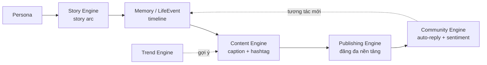

# PersonaOS — Tóm tắt cấu trúc code

> Tài liệu này tóm tắt toàn bộ codebase backend của **PersonaOS** — "Hệ điều hành AI Influencer".
> Cập nhật theo commit `3a2d681` (nhánh `main`).

---

## 1. Tổng quan

**PersonaOS** là hệ thống tạo và vận hành **AI Influencer** ("con người số") có danh tính, tính cách, ký ức, cuộc sống, nội dung và khả năng kiếm tiền riêng.

- **Backend**: FastAPI (async Python 3.11+)
- **AI/LLM**: OpenAI (GPT-4o + GPT-4o-mini), qua một lớp trừu tượng cho phép đổi provider
- **Sinh ảnh**: OpenAI GPT Image (gpt-image-2 → gpt-image-1), fallback DiceBear SVG miễn phí
- **Database**: SQLAlchemy async — SQLite (dev) / PostgreSQL (prod)
- **Vector DB**: ChromaDB (dành cho semantic memory — đã khai báo, chưa tích hợp sâu)
- **Validation**: Pydantic v2
- **UI**: Dashboard tĩnh tại `backend/static/index.html`, mount ở `/app`

Triết lý thiết kế: **mỗi giai đoạn = một Engine độc lập**, đăng ký vào hệ thống qua router. Dễ thêm/bớt module.

---

## 2. Kiến trúc phân tầng

```
HTTP request
   │
   ▼
api/v1/*.py        ← REST routes (FastAPI routers), validate I/O bằng schemas
   │
   ▼
services/*.py      ← Business logic, điều phối Engine + Database (nhận DB session qua DI)
   │
   ├──► engine/*.py    ← "Trái tim" AI: gọi LLM, xử lý logic sinh nội dung (stateless)
   │
   └──► models/*.py    ← ORM Models (SQLAlchemy), ánh xạ bảng DB
            │
            ▼
        core/database.py  ← async engine + session factory
        core/llm.py       ← lớp trừu tượng gọi OpenAI
```

**Nguyên tắc**: Services không giữ state, nhận `AsyncSession` từ dependency injection. Engines chỉ lo phần AI/logic thuần, không chạm DB.

### Sơ đồ kiến trúc (Mermaid)

```mermaid
flowchart TD
    Client([Client / Dashboard UI]) -->|HTTP| API

    subgraph API["api/v1 — REST Routers"]
        P[persona] & S[story] & M[memory] & C[content]
        CH[chat] & PUB[publishing] & COM[community] & T[trend] & MED[media]
    end

    API -->|validate| SCH[schemas — Pydantic v2]
    API --> SVC

    subgraph SVC["services — Business Logic"]
        PS[persona_service] & SS[story_service] & MS[memory_service]
        CS[content_service] & CHS[chat_service] & PBS[publishing_service]
        CMS[community_service] & TS[trend_service] & MDS[media_service]
    end

    SVC --> ENG
    SVC --> MODELS

    subgraph ENG["engine — AI Core (stateless)"]
        PE[PersonaEngine] & STE[StoryEngine] & ME[MemoryEngine]
        CE[ContentEngine] & CVE[ConversationEngine]
        PUE[PublishingEngine] & CME[CommunityEngine] & TE[TrendEngine]
    end

    ENG --> LLM[core/llm — OpenAI abstraction]
    LLM --> OAI([OpenAI API<br/>GPT-4o / 4o-mini / GPT Image])
    PUE --> SOCIAL([Social APIs<br/>TikTok/IG/FB/Threads/X])
    TE --> TRENDS([Trend sources<br/>TikTok/IG/Reddit/X])

    MODELS[models — SQLAlchemy ORM] --> DB[core/database<br/>async engine]
    DB --> STORE([(SQLite / PostgreSQL)])
```

### Vòng đời nội dung (Content lifecycle)



---

## 3. Cây thư mục

```
backend/app/
├── main.py              # FastAPI entry point: lifespan, CORS, mount static & media, /health
├── config.py            # Settings (pydantic-settings) — đọc từ .env
├── core/
│   ├── database.py      # Async SQLAlchemy engine, get_db() DI, init_db()
│   ├── dependencies.py  # Re-export get_db_session
│   └── llm.py           # Lớp trừu tượng LLM: LLM.chat / chat_json, generate_text / generate_json
├── models/              # ORM Models
│   ├── persona.py       # Persona (thực thể trung tâm)
│   ├── memory.py        # Memory + LifeEvent
│   ├── story.py         # Story (story arc — "trái tim")
│   ├── content.py       # ContentPost + ContentSchedule
│   ├── social.py        # SocialAccount + SocialPost
│   ├── social_inbox.py  # SocialInboxMessage (inbox hợp nhất đa nền tảng)
│   ├── community.py     # Comment + InboxMessage + AutoReply
│   └── monetization.py  # AffiliateProduct + ClickEvent + ConversionEvent
├── schemas/             # Pydantic v2 schemas (validation request/response)
├── engine/              # AI Engines (stateless)
│   ├── persona_engine.py       # Sinh persona
│   ├── story_engine.py         # Sinh story arc + chuyển thành life events
│   ├── memory_engine.py        # Tóm tắt hội thoại, sinh life events, tính importance
│   ├── conversation_engine.py  # Chat in-character
│   ├── content_engine.py       # Sinh caption/hashtag
│   ├── publishing_engine.py    # Đăng bài đa nền tảng (Adapter pattern)
│   ├── community_engine.py     # Phân tích sentiment, auto-reply
│   └── trend_engine.py         # Phát hiện xu hướng + đề xuất nội dung
├── services/            # Business logic (1 service / engine)
├── utils/
│   └── prompt_templates.py     # Các prompt template dùng chung
└── api/v1/
    ├── router.py        # Gom tất cả router con, prefix /api/v1
    └── persona.py, story.py, memory.py, content.py, chat.py,
        publishing.py, community.py, trend.py, media.py
```

---

## 4. Các Engine (lõi AI)

| Engine | Giai đoạn | Vai trò | Model dùng |
|--------|-----------|---------|------------|
| **PersonaEngine** | 1 | Sinh persona hoàn chỉnh từ concept; hỗ trợ "override" các trường người dùng nhập cứng (tên, tuổi, nghề...) | GPT-4o |
| **StoryEngine** | "Trái tim" | Tạo story arc (chuỗi sự kiện + cung cảm xúc + ý tưởng content) gắn với mục tiêu cuộc đời; chuyển milestone thành LifeEvent | GPT-4o |
| **MemoryEngine** | 2 | Tóm tắt hội thoại → ký ức (kèm điểm importance); sinh timeline life events; heuristic tính importance | GPT-4o-mini |
| **ConversationEngine** | cross | Chat in-character, nạp personality + memories + life events vào system prompt | GPT-4o |
| **ContentEngine** | 3 | Sinh caption/story/reel/tweet + hashtag theo giọng persona; sinh batch nội dung | GPT-4o-mini |
| **PublishingEngine** | 4 | Đăng bài lên TikTok/Instagram/Facebook/Threads/X qua **Adapter pattern**; publish song song, lấy stats | — (HTTP API) |
| **CommunityEngine** | 5 | Phân tích sentiment comment (keyword + ngữ cảnh), sinh reply in-character, ưu tiên comment cần trả lời, xử lý inbox | GPT-4o-mini |
| **TrendEngine** | 6 | Lấy trend từ TikTok/Instagram/Reddit/X (có fallback curated), chấm điểm relevance với persona, đề xuất nội dung | GPT-4o-mini |

**Điểm nhấn kiến trúc:**
- `publishing_engine.py` dùng **Adapter pattern**: `BasePlatformAdapter` (abstract) → `TikTokAdapter`, `InstagramAdapter`, `FacebookAdapter`, `ThreadsAdapter`, `XAdapter`. Thêm nền tảng mới = thêm 1 adapter + đăng ký vào `ADAPTER_MAP`.
- `trend_engine.py` có **graceful degradation**: API trend lỗi → tự rơi về danh sách trend curated sẵn.
- LLM tách 2 cấp: **model chính** (GPT-4o) cho task chất lượng cao (persona, story, chat) và **model lite** (GPT-4o-mini) cho task khối lượng lớn (caption, reply, trend).

---

## 5. Mô hình dữ liệu (Models)

**Persona** là thực thể trung tâm; mọi thứ khác tham chiếu `persona_id` (cascade delete).

- **Persona** — danh tính (tên, tuổi, nghề), ngoại hình (`appearance` JSON), `fashion_style`, `unique_appeal`, `voice_style`, `personality_type`, `personality` (JSON: traits/tone/quirks/fears/pet_phrases...), `interests`, `life_goals` (JSON structured), `relationships` (JSON), `backstory`, `avatar_url` + `avatar_gen_prompt`, các chỉ số (follower_count, total_earnings).
- **Memory** — ký ức 3 nhóm: `long_term` / `episodic` / `social`; có `importance` (0–1) và `embedding_id` (tham chiếu vector DB).
- **LifeEvent** — sự kiện trên timeline cuộc đời (có `mood_before`/`mood_after`, `event_date` có thể ở tương lai).
- **Story** — story arc: `emotional_arc`, `milestones` (JSON), tiến độ (`current_milestone`), bộ đếm events/posts đã sinh.
- **ContentPost** — bài đăng (caption, hashtags, media_urls, trạng thái draft→published, chỉ số engagement) + **ContentSchedule** (lịch đăng).
- **SocialAccount** / **SocialPost** — tài khoản kết nối + bài đã đăng theo nền tảng.
- **SocialInboxMessage** — inbox hợp nhất đa nền tảng, chống reply trùng qua `platform_message_id` (unique), vòng đời `new → pending → replied/ignored`.
- **Comment** / **InboxMessage** / **AutoReply** — tương tác cộng đồng + cấu hình auto-reply.
- **AffiliateProduct** / **ClickEvent** / **ConversionEvent** — kiếm tiền (Phase 7–8, models đã có nhưng chưa có API/engine).

---

## 6. API Endpoints (prefix `/api/v1`)

| Nhóm | Endpoint chính |
|------|----------------|
| **Persona** | `POST /personas/generate` (AI sinh persona), CRUD `/personas`, `POST /personas/{id}/regenerate-field`, `POST /personas/{id}/regenerate-avatar` |
| **Story** | `POST /stories/generate`, `GET /stories/active/{persona_id}`, `GET /stories/{persona_id}`, `POST /stories/{story_id}/complete` |
| **Memory** | `POST/GET /memories`, `POST/GET /life-events`, `POST /life-events/generate` |
| **Content** | `POST /content/generate`, `POST /content/generate/batch`, `GET /content/posts/{persona_id}`, `PATCH /content/posts/{post_id}/status`, `POST/GET /content/schedule` |
| **Chat** | `POST /chat` (chat in-character với persona) |
| **Publishing** | `POST/GET/DELETE /accounts`, `POST /publish`, `POST /check-connection`, `POST /posts/{id}/stats` |
| **Community** | `POST /analyze-comment`, `POST /auto-reply`, `POST /inbox-reply`, `POST/GET /rules`, `GET /comments/{persona_id}` |
| **Trend** | `POST/GET /fetch`, `POST /recommend`, `GET /recommend/{persona_id}`, `GET /recommend-all` |
| **Media** | `POST /media/upload`, `GET /media/{subfolder}/{filename}`, `POST /media/generate-avatar` |
| **Health** | `GET /` (redirect /app), `GET /health` |

Swagger UI: `http://localhost:8000/docs`.

---

## 7. Luồng nghiệp vụ chính

**Tạo persona (Phase 1):**
```
POST /personas/generate
  → PersonaService.generate()
     → (nếu có ảnh tham chiếu) MediaService.analyze_reference_image()  # GPT-4o Vision → prompt EN + mô tả VI
     → PersonaEngine.generate()                                        # GPT-4o sinh JSON persona
     → lưu DB
     → MediaService.generate_avatar()                                 # gpt-image-2 → gpt-image-1 → DiceBear
```

**Vòng đời nội dung (theo README):**
```
Persona → Story Engine → Memory/LifeEvent → Content Engine → Publishing → Community
```

**Sinh avatar (đáng chú ý — `media_service.py`):**
- Thử lần lượt `gpt-image-2` → `gpt-image-1`; nhận `b64_json` hoặc `url`, lưu vào `media/avatars/`.
- Nếu lỗi auth (401/403) → dừng, nếu hết tiền/không khả dụng → fallback **DiceBear SVG** (miễn phí, luôn chạy), kèm `note` cảnh báo.
- Ghi chú trong code: DALL-E 2 & 3 đã bị OpenAI khai tử 12/05/2026.

---

## 8. Cấu hình (`.env` qua `config.py`)

Các biến quan trọng:
- `OPENAI_API_KEY`, `OPENAI_MODEL` (gpt-4o), `OPENAI_MODEL_LITE` (gpt-4o-mini), `OPENAI_BASE_URL`
- `DATABASE_URL` (mặc định SQLite `data/personaos.db`)
- `LLM_PROVIDER`, `VECTOR_DB_PROVIDER` / `CHROMADB_PATH`
- Token mạng xã hội: `TIKTOK_ACCESS_TOKEN`, `INSTAGRAM_ACCESS_TOKEN`, `FACEBOOK_ACCESS_TOKEN`, `THREADS_ACCESS_TOKEN`, `X_API_KEY`
- `MEDIA_DIR`, `CONTENT_SCHEDULE_INTERVAL_HOURS`, `AUTO_REPLY_ENABLED`, `AFFILIATE_PROGRAM`

---

## 9. Trạng thái lộ trình

| GĐ | Engine | Trạng thái |
|----|--------|-----------|
| 1 | Persona | ✅ Hoạt động |
| 2 | Memory + Life | ✅ Hoạt động |
| 3 | Content | ✅ Hoạt động |
| 4 | Publishing | ✅ Hoạt động (cần token thật để đăng) |
| 5 | Community | ✅ Hoạt động |
| 6 | Trend | ✅ Hoạt động |
| 7–10 | Monetization / Revenue / Multi-Persona / SaaS | 📋 Kế hoạch (models monetization đã có, chưa có API/engine) |

---

## 10. Ghi chú kỹ thuật

- **`from __future__ import annotations`** được dùng ở các module engine/service → annotation lazy, nên dù `persona_service.py` chỉ `import Any` mà vẫn dùng `Optional[str]` ở `regenerate_avatar()` thì không lỗi runtime (annotation không bị evaluate).
- **CORS** đang mở `allow_origins=["*"]` — cần siết lại khi lên production.
- **ChromaDB** đã khai báo dependency và config nhưng MemoryEngine hiện chưa thực sự lưu/truy vấn embedding (chỉ có trường `embedding_id` để dành).
- **Migration**: có sẵn Alembic (`alembic/versions/0001_initial.py`); ngoài ra `init_db()` tự `create_all` khi startup cho môi trường dev.
```
